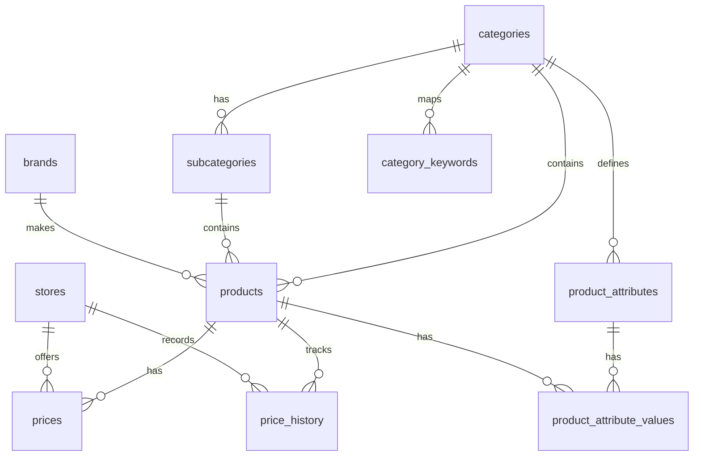

# ⚡ Dawarly (دورلي) — Egypt's Price Comparison Engine

> **Compare prices across 13+ Egyptian stores — find the best deals on phones, laptops, electronics, and more.**

Dawarly is a full-stack price comparison platform that scrapes product data from major Egyptian e-commerce stores, normalizes it into a unified database, and presents it through a modern bilingual (English/Arabic) web interface with real-time price comparison, historical price charts, and smart product merging.

---

## 📑 Table of Contents

- [Features](#-features)
- [Tech Stack](#-tech-stack)
- [Project Structure](#-project-structure)
- [Database Architecture](#-database-architecture)
- [Scrapers](#-scrapers)
- [API Reference](#-api-reference)
- [Frontend](#-frontend)
- [Utility Scripts](#-utility-scripts)
- [Getting Started](#-getting-started)
- [Docker Deployment](#-docker-deployment)
- [Daily Sync (Cron)](#-daily-sync-cron)

---

## ✨ Features

| Feature | Description |
|---|---|
| **Multi-Store Scraping** | 13 scrapers pull product data from Egypt's biggest retailers |
| **Price Comparison** | Side-by-side pricing from all stores for any product |
| **Price History Charts** | Track how prices change over time (Chart.js) |
| **Smart Product Merging** | Duplicate products from different stores are automatically linked |
| **Bilingual UI (EN/AR)** | Full RTL Arabic support with a single toggle |
| **Auto-Classification** | Products are auto-classified into categories via keyword matching |
| **Bilingual Enrichment** | Auto-generated Arabic & English names and descriptions |
| **Brand Normalization** | Handles Arabic/English brand name variants (e.g. سامسونج → Samsung) |
| **Top Savings** | Highlights products with the biggest price gaps across stores |
| **Daily Auto-Sync** | Cron job runs all scrapers and refreshes data at 3:00 AM daily |
| **Docker Ready** | Single Dockerfile for easy deployment |
| **Amazon Affiliate** | Automatic Amazon affiliate tag injection on product URLs |

---

## 🛠 Tech Stack

### Backend
- **Runtime:** Node.js 20 + Express.js
- **Database:** SQLite via `better-sqlite3`
- **Scheduler:** `node-cron` (daily sync at 3 AM)

### Scrapers (Python)
- **Browser Automation:** Playwright (headless Chromium)
- **HTML Parsing:** BeautifulSoup4 + lxml
- **Async I/O:** asyncio + aiofiles

### Frontend
- **SPA:** Vanilla HTML/CSS/JS (Single Page Application)
- **Charts:** Chart.js for price history visualization
- **Font:** Inter + Roboto (Google Fonts)
- **Design:** Dark-mode-ready, glassmorphism, responsive

---

## 📁 Project Structure

```
store/
├── server.js                  # Express API server (main entry point)
├── db_schema.py               # SQLite schema + data loader + auto-classifier
├── pc_parts.db                # SQLite database (~38 MB)
├── package.json               # Node.js dependencies
├── requirements.txt           # Python dependencies
├── Dockerfile                 # Docker build (Node + Python + Playwright)
├── .gitignore
│
├── config/
│   └── categories.json        # Category hierarchy definition (9 categories, 50+ subcategories)
│
├── services/                  # Backend service layer
│   ├── categoryService.js     # Category queries, tree, breadcrumbs
│   ├── productService.js      # Search, browse, featured, trending, deals, price history
│   └── filterService.js       # Dynamic filters (brands, price range, attributes)
│
├── public/                    # Frontend (served as static files)
│   ├── index.html             # Main HTML (SPA shell)
│   ├── app.js                 # Frontend logic (574 lines — routing, rendering, i18n)
│   └── style.css              # Complete CSS design system
│
├── scripts/                   # Data processing utilities
│   ├── seed_categories.py     # Seeds categories.json into the DB
│   ├── enrich_utils.py        # Bilingual name/description generation
│   ├── enrich_all.py          # Batch enrichment for all products
│   ├── enrich_phones.py       # Phone-specific enrichment
│   ├── merge_products.py      # Cross-store product deduplication & merging
│   ├── normalize_brands.py    # Brand name standardization
│   ├── reclassify.py          # Re-run auto-classification on all products
│   ├── reclassify_accessories.py  # Accessories-specific reclassification
│   └── scrape_quick.py        # Quick single-scraper runner
│
├── sync_all.py                # Master sync: runs all PC scrapers → loads into DB
├── sync_mobiles.py            # Mobile-only sync: runs 9 mobile scrapers → loads into DB
│
├── scraper.py                 # Sigma Computer scraper (main/original)
├── elbadr_scraper.py          # El Badr Group scraper
├── compumarts_scraper.py      # Compumarts scraper
├── maximum_scraper.py         # Maximum Hardware scraper
├── noon_scraper.py            # Noon scraper
├── amazon_scraper.py          # Amazon Egypt scraper
├── btech_scraper.py           # B.TECH scraper
├── dubaiphone_scraper.py      # Dubai Phone scraper
├── dream2000_scraper.py       # Dream 2000 scraper
├── alsheikh_scraper.py        # Al Sheikh Stores scraper
├── raya_scraper.py            # Raya Shop scraper
├── twob_scraper.py            # 2B scraper
├── jumia_scraper.py           # Jumia scraper
│
└── output/                    # Scraper JSON output (temporary, cleaned after sync)
```

---

## 🗄 Database Architecture

The database is SQLite (`pc_parts.db`) with the following schema:



### Core Tables

| Table | Purpose |
|---|---|
| `categories` | Top-level categories (Electronics, Computers, Fashion, etc.) — 9 categories |
| `subcategories` | Nested subcategories with multi-level support (50+ subcategories) |
| `products` | Unified product records with bilingual names, specs, and merged product links |
| `stores` | 13 registered stores (Sigma, B.TECH, Amazon, Noon, Jumia, etc.) |
| `prices` | Latest price snapshot per product per store (unique on product_id + store_id) |
| `price_history` | Historical price log for charting trends |
| `brands` | Normalized brand registry |
| `product_attributes` | Dynamic attribute definitions per category (RAM, Storage, Screen Size, etc.) |
| `product_attribute_values` | Actual attribute values per product |
| `category_keywords` | Keywords for automatic product classification |

### Key Views

| View | Purpose |
|---|---|
| `cheapest_prices` | Cheapest in-stock price per product across all stores |
| `product_all_prices` | All prices from all stores for each product |

### Product Merging

Products from different stores that represent the same item are linked via `merged_product_id`. The merge algorithm:
1. Extracts storage, RAM, and model key from product names (supports Arabic & English)
2. Groups products by `(subcategory, brand, storage, RAM, model_key)`
3. Selects the best "master" product (has image + longest name)
4. Links all duplicates to the master via `merged_product_id`

---

## 🕷 Scrapers

All scrapers use **Playwright** (headless Chromium) and output JSON to `output/`.

### Registered Stores

| # | Store | Slug | Scraper File | Focus |
|---|---|---|---|---|
| 1 | Sigma Computer | `sigma` | `scraper.py` | PC Parts, Hardware |
| 2 | El Badr Group | `badr-group` | `elbadr_scraper.py` | PC Parts, Hardware |
| 3 | Compumarts | `compumarts` | `compumarts_scraper.py` | PC Parts |
| 4 | Maximum Hardware | `maximum-hardware` | `maximum_scraper.py` | PC Parts |
| 5 | Noon | `noon` | `noon_scraper.py` | Marketplace (all) |
| 6 | Amazon Egypt | `amazon` | `amazon_scraper.py` | Marketplace (all) |
| 7 | B.TECH | `btech` | `btech_scraper.py` | Mobiles, Electronics |
| 8 | Dubai Phone | `dubaiphone` | `dubaiphone_scraper.py` | Mobiles |
| 9 | Dream 2000 | `dream2000` | `dream2000_scraper.py` | Mobiles |
| 10 | Al Sheikh Stores | `alsheikhstores` | `alsheikh_scraper.py` | Mobiles |
| 11 | Raya Shop | `rayashop` | `raya_scraper.py` | Mobiles, Electronics |
| 12 | 2B | `2b` | `twob_scraper.py` | Mobiles, Electronics |
| 13 | Jumia | `jumia` | `jumia_scraper.py` | Marketplace (all) |

### Scraper Usage

```bash
# Sigma Computer — specific category
python scraper.py --category hardware_components

# Sigma Computer — search
python scraper.py --search "rtx 4070"

# Sigma Computer — all categories
python scraper.py --all

# Any mobile scraper
python btech_scraper.py --mobiles
```

### JSON Output Format

```json
{
  "scraped_at": "2026-05-19T10:00:00Z",
  "source": "sigma-computer.com",
  "total": 150,
  "products": [
    {
      "id": "product-slug",
      "name": "NVIDIA GeForce RTX 4070 Ti SUPER",
      "price_egp": 42500.0,
      "original_price_egp": 45000.0,
      "discount_pct": 5.6,
      "availability": "in_stock",
      "category": "hardware_components",
      "brand": "NVIDIA",
      "image_url": "https://...",
      "product_url": "https://...",
      "specs": {}
    }
  ]
}
```

---

## 🌐 API Reference

The Express server runs on port `3000` and exposes these endpoints:

### Categories

| Method | Endpoint | Description |
|---|---|---|
| `GET` | `/api/categories` | List all categories with product counts |
| `GET` | `/api/categories/tree` | Full category navigation tree (with subcategories) |
| `GET` | `/api/categories/:slug` | Single category detail + subcategories |
| `GET` | `/api/categories/:slug/products` | Products in a category (paginated, filterable) |
| `GET` | `/api/subcategories/:slug/products` | Products in a subcategory |

### Products

| Method | Endpoint | Description |
|---|---|---|
| `GET` | `/api/search?q=...` | Search products by keyword (bilingual) |
| `GET` | `/api/products/:id` | Product detail with all store prices |
| `GET` | `/api/products/:id/history` | Price history (grouped by store) |
| `GET` | `/api/featured` | Featured products for homepage |
| `GET` | `/api/trending` | Trending products |
| `GET` | `/api/deals` | Best deals (highest discount %) |
| `GET` | `/api/recent` | Recently added products |
| `GET` | `/api/top-savings` | Products with biggest cross-store price gaps |
| `GET` | `/api/suggestions` | Random product suggestions |

### Filters & Metadata

| Method | Endpoint | Description |
|---|---|---|
| `GET` | `/api/filters/:categorySlug` | Dynamic filters for a category (brands, price range, attributes) |
| `GET` | `/api/filters/sub/:subcategorySlug` | Dynamic filters for a subcategory |
| `GET` | `/api/stores` | List all stores with product counts |
| `GET` | `/api/stats` | Dashboard stats (total products, stores, categories, last sync) |

### Query Parameters (Browse/Search)

| Param | Type | Default | Description |
|---|---|---|---|
| `page` | int | 1 | Page number |
| `limit` | int | 52 | Products per page |
| `sort` | string | `price_asc` | Sort: `price_asc`, `price_desc`, `name_asc`, `name_desc`, `newest` |
| `brand` | string | — | Filter by brand name |
| `min_price` | float | — | Minimum price filter |
| `max_price` | float | — | Maximum price filter |
| `in_stock` | bool | false | Show only in-stock products |

---

## 🎨 Frontend

The frontend is a **Single Page Application** built with vanilla HTML/CSS/JS, served as static files from `public/`.

### Pages & Views

| View | Description |
|---|---|
| **Homepage** | Hero search, stats bar, categories grid, top savings, featured, deals, recent |
| **Browse View** | Category/subcategory browsing with breadcrumbs, subcategory chips, brand filters, sorting |
| **Product Modal** | Full price comparison table, product image, bilingual descriptions, price history chart |

### Bilingual Support (EN/AR)

- **Language Toggle:** Persistent toggle in the header (saved to `localStorage`)
- **RTL:** Automatic `dir="rtl"` on `<html>` when Arabic is selected
- **Product Names:** `name_en` and `name_ar` fields, displayed based on active language
- **Descriptions:** `description_en` and `description_ar` — auto-generated from product specs
- **UI Labels:** Full translation map for all UI strings

### Key Frontend Features

- **Responsive Design:** Mobile-first with drawer navigation on small screens
- **Product Cards:** Show brand, bilingual name, price range, store count, savings badge
- **Price History:** Chart.js line chart per store inside the product detail modal
- **Category Navigation:** Horizontal scrollable nav bar + mobile drawer
- **Brand Filtering:** Dynamic brand chips with counts
- **Amazon Affiliate:** Automatic `tag=dwrlycrts-21` injection on Amazon links

---

## 🔧 Utility Scripts

Located in `scripts/`:

| Script | Purpose |
|---|---|
| `seed_categories.py` | Seeds `config/categories.json` into the database (categories, subcategories, keywords) |
| `enrich_utils.py` | Core bilingual enrichment engine — generates standardized EN/AR names and descriptions from raw product data |
| `enrich_all.py` | Batch-runs enrichment on all products in the database |
| `enrich_phones.py` | Phone-specific enrichment with detailed spec parsing |
| `merge_products.py` | Cross-store product deduplication — groups same products and links them to a master record |
| `normalize_brands.py` | Standardizes brand names across Arabic/English variants |
| `reclassify.py` | Re-runs auto-classification on all products |
| `reclassify_accessories.py` | Moves misclassified phone accessories from smartphones to phone-accessories subcategory |
| `scrape_quick.py` | Quick runner for a single scraper |

### Auto-Classification Engine

Products are automatically classified into categories using two methods:

1. **CATEGORY_MAP Lookup:** Maps raw scraper category strings to normalized subcategory slugs
2. **Keyword Matching:** Matches product names against `category_keywords` table entries with weighted scoring

Special logic detects phone accessories (cases, chargers, cables, etc.) and redirects them from "smartphones" to "phone-accessories".

### Brand Normalization

Handles variants like:
- `سامسونج` / `samsung` → **Samsung**
- `ابل` / `أبل` / `iphone` → **Apple**
- `شاومي` / `شاومى` / `redmi` → **Xiaomi**
- `انفنيكس` / `أنفنيكس` / `انفنكس` → **Infinix**

---

## 🚀 Getting Started

### Prerequisites

- **Node.js** 20+
- **Python** 3.10+
- **Playwright** browsers installed

### Installation

```bash
# 1. Clone the repository
git clone <repo-url>
cd store

# 2. Install Node dependencies
npm install

# 3. Create Python virtual environment
python -m venv venv
venv\Scripts\activate        # Windows
# source venv/bin/activate   # Linux/Mac

# 4. Install Python dependencies
pip install -r requirements.txt

# 5. Install Playwright browsers
python -m playwright install chromium

# 6. Initialize the database
python db_schema.py

# 7. Seed categories
cd scripts
python seed_categories.py
cd ..

# 8. (Optional) Run scrapers to populate data
python sync_all.py       # PC parts stores
python sync_mobiles.py   # Mobile stores

# 9. (Optional) Merge duplicate products
python scripts/merge_products.py

# 10. Start the server
npm start
```

The server will be available at `http://localhost:3000`.

---

## 🐳 Docker Deployment

```bash
# Build the image
docker build -t dawarly .

# Run the container
docker run -p 3000:3000 dawarly
```

The Dockerfile:
1. Uses `node:20-slim` base image
2. Installs Python 3 + Playwright + Chromium dependencies
3. Installs Node and Python packages
4. Runs `python3 db_schema.py` to initialize the DB on startup
5. Starts the Express server on port 3000

---

## ⏰ Daily Sync (Cron)

The server automatically runs `sync_all.py` every day at **3:00 AM** via `node-cron`:

```
0 3 * * *  →  python3 sync_all.py
```

### Sync Flow

```
1. Run each scraper (Sigma, El Badr, Maximum, Compumarts, Noon, Amazon)
2. Each scraper outputs JSON to output/
3. Load JSON data into SQLite via db_schema.load_scraper_output()
4. Auto-classify products into categories
5. Auto-enrich with bilingual names/descriptions
6. Record price history
7. Clean up temporary JSON files
```

### Mobile Sync

A separate sync script (`sync_mobiles.py`) handles mobile-focused stores:

```bash
python sync_mobiles.py
```

Runs 9 scrapers: Noon, Amazon, B.TECH, Dubai Phone, Dream 2000, Al Sheikh, Raya, 2B, Jumia.

---

## 📊 Category Hierarchy

The platform supports **9 top-level categories** with **50+ subcategories**:

| Category | Icon | Subcategories |
|---|---|---|
| Electronics | 📱 | Smartphones, Phone Accessories, Tablets, Smart Watches, TVs, Cameras, Printers |
| Computers & PC Parts | 💻 | Laptops, Graphics Cards, Processors, Motherboards, RAM, Storage, Cases, PSUs, Cooling, Monitors, PC Bundles |
| Peripherals & Accessories | ⌨️ | Keyboards & Mice, Audio, Gaming Accessories, Cables, Networking, Cameras & Streaming, Laptop Accessories |
| Home Appliances | 🏠 | Refrigerators, Washing Machines, ACs, Microwaves, Vacuums, Water Heaters |
| Fashion | 👕 | Men Clothing, Women Clothing, Shoes, Bags, Watches, Accessories |
| Beauty & Health | 💄 | Makeup, Skincare, Perfumes |
| Grocery | 🛒 | Snacks, Beverages, Coffee & Tea |
| Automotive | 🚗 | Car Accessories, Tires, Oils & Fluids |
| Office & Furniture | 🖇️ | Office Chairs, Desks, Office Supplies |

---

## 📜 License

ISC
