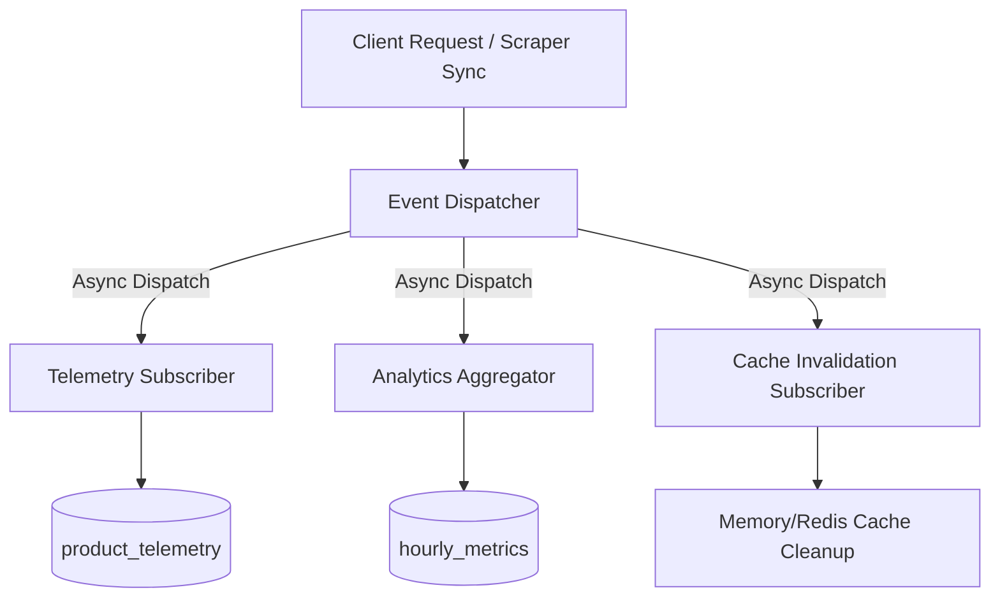

# Arkhsly Platform Infrastructure Architecture Specification

This document defines the production-grade architectural standards, designs, and migration pathways for the Arkhsly platform's core infrastructure.

---

## 1. Centralized Event-Driven Architecture

To decouple core operations (e.g., telemetry, auditing, cache invalidation, search syncing), Arkhsly implements a centralized, in-process Event Dispatcher.

### Event Schema Standard
All events dispatched in the platform must conform to the following JSON schema:

```json
{
  "eventId": "uuid-v4-string",
  "eventType": "PRODUCT_VIEWED | SEARCH_EXECUTED | FILTER_APPLIED | PRODUCT_CLICKED | COMPARE_STARTED | PRICE_CHANGED | DEAL_DETECTED",
  "timestamp": "ISO-8601-datetime-string",
  "actor": {
    "ipHash": "sha-256-hash",
    "userAgent": "string"
  },
  "payload": {
    "familyId": "integer (optional)",
    "variantId": "integer (optional)",
    "query": "string (optional)",
    "filters": "object (optional)",
    "meta": "object (optional)"
  }
}
```

### Event Handling Pipeline


- **In-process dispatching**: Initially executed using Node's standard `EventEmitter` with error-isolation boundaries.
- **Future scaling path**: Can be seamlessly replaced with a message broker (e.g., RabbitMQ or Apache Kafka) for distributed microservices.

---

## 2. Asynchronous Background Job System

Heavy operations are completely removed from the request-response thread of the Express application.

### Architecture Overview
1. **Job Enqueueing**: Request handler saves job parameters to the database (`job_queue` table) with status `pending`.
2. **Worker Loop**: A background thread/process polls the database for `pending` jobs, locks them by marking them `processing`, executes them, and updates their status to `completed` or `failed`.
3. **Queue States**:
   - `pending`: Awaiting worker pick-up.
   - `processing`: Locked and executing.
   - `completed`: Successfully processed.
   - `failed`: Terminated with an error message and traceback.

```
                  ┌─────────────────┐
                  │   Express App   │
                  └────────┬────────┘
                           │
                  Enqueues │ INSERT INTO job_queue
                           ▼
                  ┌─────────────────┐
                  │ SQLite Database │
                  └────────▲────────┘
                           │
             Polls / Locks │ UPDATE ... STATUS = 'processing'
                           ▼
                  ┌─────────────────┐
                  │ Worker Instance │
                  └─────────────────┘
```

### Future Scaling (BullMQ & Redis)
For multi-node production scaling:
- Replace the SQLite-backed database queue with **BullMQ** running on a **Redis** cluster.
- BullMQ provides atomicity, delayed jobs, retries, and high-concurrency worker routing out-of-the-box.

---

## 3. Ranking Versioning & Formula Rollbacks

To prevent ranking instability and enable A/B testing, the ranking engine supports formula versioning.

### Ranking Version Schema
The system references a `ranking_versions` catalog:

| Version ID | Formula Key | Weights Configuration (JSON) | Description | Is Active |
|---|---|---|---|---|
| `v1` | `baseline` | `{"price":0.25,"discount":0.20,"stores":0.15,"pop":0.20,"spec":0.20}` | Original formula | `1` |
| `v2` | `discount_heavy` | `{"price":0.15,"discount":0.40,"stores":0.10,"pop":0.15,"spec":0.20}` | Heavier weight on deals | `0` |

### Rollback Strategy
- The admin dashboard updates the `is_active` flag in `ranking_versions`.
- Rolling back simply requires switching the active version to `v1` and queuing a `recalculate_ranks` background job.

---

## 4. Feature Flag System

Feature flags permit staged rollouts, enabling safe deployments of experimental features.

### Configuration Rules
- **Flag Resolution**: Checks local cache configuration, falling back to database settings.
- **Dynamic Overrides**: Allow toggling features for specific target segments (e.g., testing `enable_compare_v2` for requests coming from internal admin subnets or carrying `x-enable-beta` headers).

---

## 5. Centralized Error Taxonomy

A consistent error classification system ensures robust tracing and prevents database error leakage to users.

### Taxonomies
- **`DB_ERROR`**: SQLite locking, query failures, constraint violations.
- **`VALIDATION_ERROR`**: Incomplete payloads, invalid sorting keys, bad parameter types.
- **`NOT_FOUND_ERROR`**: Missing product families, categories, or variants.
- **`SCRAPER_ERROR`**: Heavy Python import errors, selector changes, connection drops.
- **`CACHE_ERROR`**: Cache serialization issues, invalidation write failures.
- **`MERGE_ERROR`**: Ingestion pipeline validation mismatches, brand reclassification failures.

---

## 6. Incremental Cache Invalidation

Full cache regeneration is resource-intensive. The platform uses targeted cache invalidation.

- **Entity Tagging**: Cache entries are keyed by entity prefixes (e.g., `prod:123`, `cat:laptops`).
- **Triggered Invalidation**: When a scraper imports an active store offer for variant `v`, the system dispatches a `PRICE_CHANGED` event. The cache manager intercepts it and deletes entries matching `prod:{v.familyId}` and `cat:{v.categorySlug}` without affecting the rest of the cache.

---

## 7. Search Separation Roadmap (FTS5 to Typesense/Elasticsearch)

SQLite FTS5 is a single-node search system. As Arkhsly grows, search operations must migrate to a dedicated engine.

### Migration Phases
1. **Shadow Indexing**: Write a background pipeline that mirrors SQLite product data into **Typesense** or **Elasticsearch** in real-time.
2. **Read Diverter**: Use a feature flag (`enable_external_search`) to direct 5% of frontend searches to Typesense, monitoring response times and error rates.
3. **Full Cutover**: Transition 100% of search traffic. Keep SQLite FTS5 as a fallback search query parser in case of network outages.

---

## 8. Frontend Framework Migration Strategy

To support frontend team scaling, the vanilla JS codebase must migrate to a modern component-driven framework.

### Recommended Path: Svelte or React (Hybrid Coexistence)
- **Why Svelte**: High performance, zero-runtime overhead, compile-time optimization, and easily integrates into vanilla JS wrappers without breaking existing CSS.
- **Gradual Migration Path**:
  1. Move isolated standalone widgets (e.g., the Comparison Matrix or the Operations Dashboard) to Svelte components.
  2. Embed these components into existing pages using standard JS mount nodes.
  3. Evolve the system into a complete Single Page App (SPA) once all modules are componentized.
